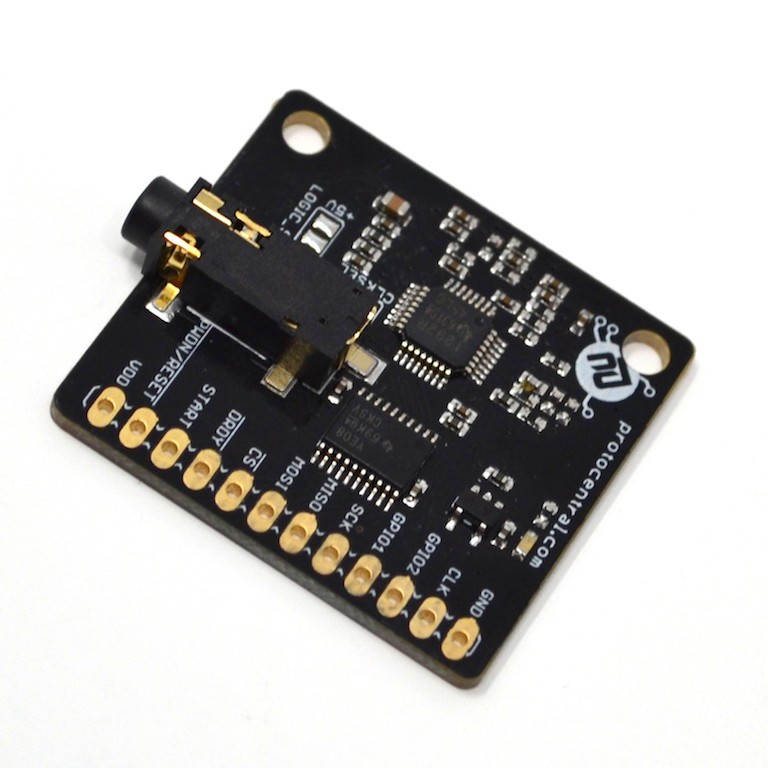
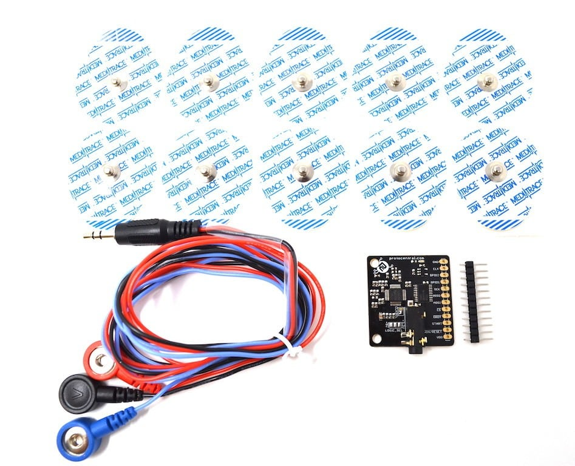
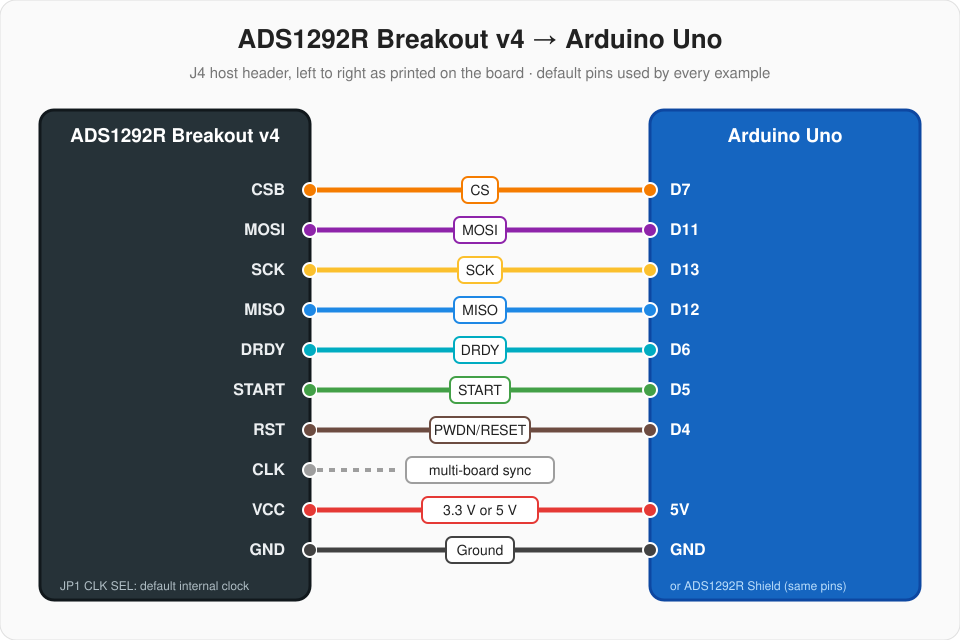
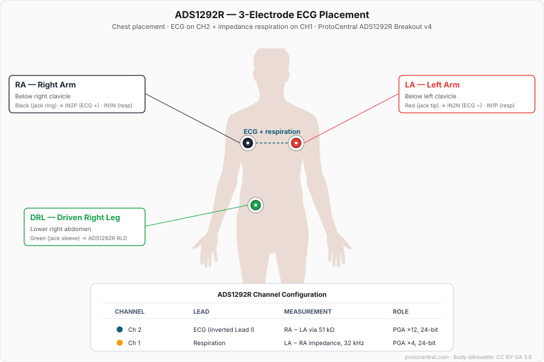
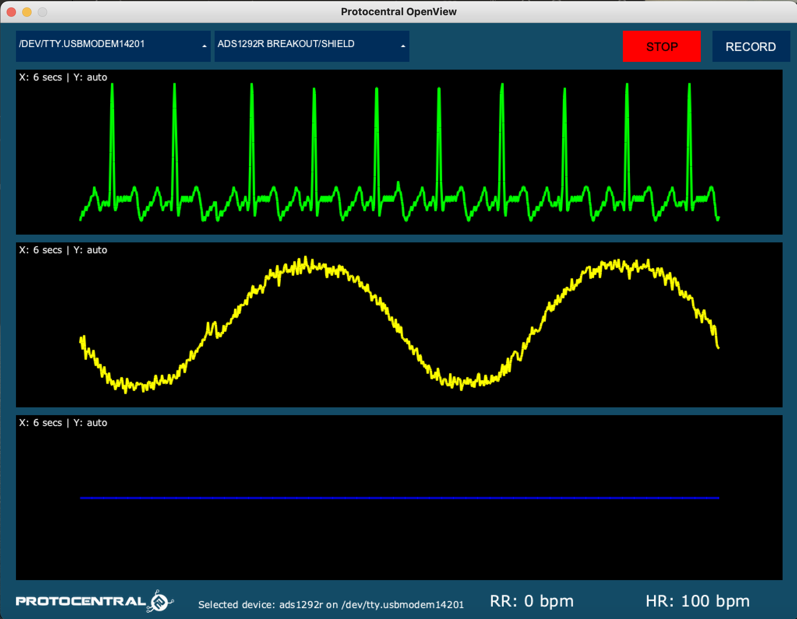

# ProtoCentral ADS1292R ECG and Respiration Arduino Library

[](https://github.com/Protocentral/protocentral-ads1292r-arduino/actions/workflows/arduino-lint.yml)
[](https://github.com/Protocentral/protocentral-ads1292r-arduino/actions/workflows/compile-examples.yml)

Arduino library for the **ProtoCentral ADS1292R ECG and Respiration Breakout (v4)** and **ADS1292R Shield**: single-lead ECG and impedance-pneumography respiration from the TI ADS1292R 24-bit analog front end, with heart-rate and respiration-rate algorithms that run on an Arduino Uno.

## Don't have one? [Buy it here](https://protocentral.com/product/ads1292r-ecg-respiration-breakout-kit/)



## Links

| | |
|---|---|
| 🛒 Breakout v4 product page | https://protocentral.com/product/ads1292r-ecg-respiration-breakout-kit/ |
| 🛒 Shield for Arduino | https://protocentral.com/product/ads1292r-ecg-respiration-shield-for-arduino-v2/ |
| 🔧 Hardware design files | https://github.com/Protocentral/ADS1292rShield_Breakout |
| 📈 OpenView companion app | https://github.com/Protocentral/protocentral_openview |
| 📄 ADS1292R datasheet (TI SBAS502) | https://www.ti.com/lit/ds/symlink/ads1292r.pdf |

## How it works

The ADS1292R has two simultaneously sampled 24-bit delta-sigma channels. Each channel has a programmable-gain amplifier, and the chip also contains the ECG-specific blocks: right-leg drive, lead-off comparators and a respiration modulator. ProtoCentral boards use the two channels like this:

| Channel | Signal | How |
|---|---|---|
| **CH2** | ECG | RA and LA electrodes through 51 kΩ, PGA gain 12. Right-leg drive (RL) holds the body at mid-supply and cancels common-mode noise. |
| **CH1** | Respiration | Impedance pneumography. The chip drives a small 32 kHz excitation current through the same RA/LA electrodes and demodulates the result. As the chest expands, its impedance changes by a fraction of an ohm, and CH1 follows it. |

Both channels are read together at 125 samples per second by default (up to 8 kSPS). Each sample also carries the per-electrode lead-off status and the GPIO pin levels, so the library gets them at no extra SPI cost.

The optional `ADS1292R_Algorithms` class turns the raw samples into heart rate and respiration rate:
- **ECG path:**
  - DC blocker and 40 Hz FIR low-pass
  - QRS detector with an adaptive threshold
  - R-R averaging
- **Respiration path:**
  - DC blocker and 2 Hz FIR low-pass
  - breath-cycle zero-crossing detection

The processing is fixed-point and uses about 1 KB of RAM.

## Hardware revisions

| Board | Host connector | Notes |
|---|---|---|
| **Breakout v4** (current) | 1×10 0.1" female socket: CSB, MOSI, SCK, MISO, DRDY, START, RST, CLK, VCC, GND | <ul><li>34.5 × 28.7 mm, 2 × M2 holes</li><li>On-board 3.3 V regulator and TXB0108 level shifter</li><li>CLK on the header plus CLK SEL jumper, for multi-board sync</li><li>GPIO1/GPIO2 test pads</li></ul> |
| Breakout Rev 3 | Header pads, pin labelled PWDN/RESET | Same chip and signals; no CLK on the header |
| Shield v2 | Plugs onto an Arduino Uno (D4–D7, SPI) | Same pins as the examples' defaults |

All three run the same library and examples. **RST** on v4 is the same pin as **PWDN/RESET** on older boards.

### What's in the box

The breakout kit contains:
- the board
- a 3.5 mm electrode cable with snap leads
- 10 disposable ECG electrodes



## Features

- **ECG and respiration**
  - Sample rate 125 SPS – 8 kSPS
  - PGA gain 1, 2, 3, 4, 6, 8 or 12 per channel
  - 2.42 V or 4.033 V internal reference
- **Lead-off detection** per electrode (DC or AC, selectable threshold and current), reported with every sample
- **Respiration control**
  - 32 or 64 kHz modulation
  - Demodulation phase in 11.25° steps
  - Offset calibration
- **Heart rate (40–200 bpm) and respiration rate (6–45 br/min)** with the optional algorithms
  - About 1 KB of RAM
  - ECG + respiration fit on an Arduino Uno
- **Self-test**
  - Internal 1 Hz test signal
  - Shorted-input noise floor
  - On-die **temperature** sensor
  - **AVDD / DVDD** supply monitoring
- **Right-leg drive**, with selectable sources and RL lead-off sensing
- **v4 hardware features:** **CLK output for multi-board clock sync** and **GPIO1/GPIO2**
- **Data-ready handling:** polled or **interrupt-driven**, with a missed-sample counter
- **Shared-bus safe**
  - SPI transactions on any `SPIClass`
  - Settings can be changed while streaming
  - Every register write is verified by read-back
- **Standalone:** `depends=` is empty, so there is nothing else to install
- **Host boards:** Uno, Nano, Mega, Leonardo, Uno R4, Nano 33 BLE, ESP32, ESP32-C3 and RP2040, at 3.3 V or 5 V

## Safety

> **Not a medical device. For research and education only.**
>
> These boards have **no patient isolation**. When electrodes are on a person, power the host from a **battery**. Never connect electrodes while the host is plugged into mains-powered USB or test equipment.

## Installation

### Arduino Library Manager (Recommended)

1. Open **Sketch → Include Library → Manage Libraries…**
2. Search for **ProtoCentral ADS1292R**.
3. Install **ProtoCentral ADS1292R ECG and Respiration boards library**.

### Manual Installation

Download this repository as a ZIP, then use **Sketch → Include Library → Add .ZIP Library…**

## Hardware Setup



| v4 pin | Function | Arduino Uno | ESP32 DevKit | Uno R4 / Nano 33 BLE |
|---|---|---|---|---|
| CSB   | SPI chip select | D7 | GPIO13 | D7 |
| MOSI  | SPI data in | D11 | GPIO23 | D11 |
| SCK   | SPI clock | D13 | GPIO18 | D13 |
| MISO  | SPI data out | D12 | GPIO19 | D12 |
| DRDY  | Data ready, active low | D6 | GPIO26 | D6 |
| START | Start conversions | D5 | GPIO14 | D5 |
| RST   | Power-down / reset (PWDN/RESET on older boards) | D4 | GPIO27 | D4 |
| CLK   | Clock in/out for multi-board sync (leave open) | - | - | - |
| VCC   | 3.3 V or 5 V | 5V | 3V3 | 5V / 3V3 |
| GND   | Ground | GND | GND | GND |

**Pin notes**
- **Shield:** the ADS1292R Shield plugs straight onto an Uno and already uses these pins.
- **Interrupts:** to use DRDY interrupts on an Uno, move DRDY to D2 or D3 (example 07).
- **Optional pins:** START and RST can be left out by passing `-1` to the constructor. The library then uses the START/STOP and RESET commands, and START must be tied low.
- **Clock jumper (CLK SEL, JP1):**
  - Default: internal clock. Leave it there for a single board.
  - Set it to external only on the receiving board of a multi-board setup (example 08).
  - With no clock the chip does not answer on SPI.

### Electrode placement



Plug the electrode cable into the 3.5 mm jack. Use fresh gel electrodes on clean, dry skin:

| Electrode | Placement | Jack | Connects to |
|---|---|---|---|
| **RA** (black) | Below the right collarbone | Ring | IN2P (ECG +), IN1N (respiration) |
| **LA** (red) | Below the left collarbone | Tip | IN2N (ECG −), IN1P (respiration) |
| **RL / DRL** (green) | Lower right abdomen | Sleeve | Right-leg drive |

**Respiration:** it uses the same RA/LA pair. Chest placement gives a much larger respiration signal than wrist or limb placement.

**ECG polarity:** CH2 records **RA − LA**, which is inverted relative to standard Lead I. To display upright R-waves, negate the value:
- raw samples: `-s.ecg`
- algorithm output: `-algo.filteredEcg()`

## Quick Start

```cpp
#include <SPI.h>
#include "Protocentral_ADS1292R.h"

Protocentral_ADS1292R ads(7 /*CS*/, 6 /*DRDY*/, 5 /*START*/, 4 /*RST*/);

void setup() {
    Serial.begin(115200);
    if (!ads.begin()) {             // reset, check chip ID, start ECG + respiration at 125 SPS
        Serial.println("ADS1292R not found");
        while (1);
    }
}

void loop() {
    ADS1292R_Sample s;
    if (ads.available() && ads.read(s)) {
        Serial.print(s.ecg);        // signed 24-bit counts
        Serial.print(' ');
        Serial.println(s.resp);     // s.leadOff != 0 when an electrode is off
    }
}
```

### Heart rate and respiration rate

```cpp
#include "Protocentral_ADS1292R_Algorithms.h"

ADS1292R_Algorithms algo;               // in setup(): algo.begin(ads.getSampleRate());

algo.processSample(s.ecg, s.resp);      // every sample, at 125 SPS
algo.heartRate();                       // bpm, 0 until locked (~5 s)
algo.respirationRate();                 // breaths/min, 0 until locked (~10-30 s)
algo.filteredEcg();                     // band-passed ECG, int16
```

### Custom configuration

`begin()` with no arguments applies the ProtoCentral ECG + respiration profile:
- 125 SPS
- CH1 respiration: gain 4, 32 kHz modulation, 135° phase (TI's recommended setting)
- CH2 ECG: gain 12
- 2.42 V reference
- RLD from CH2
- DC lead-off on the ECG electrodes

To change it, pass an `ADS1292R_Config`. Any setter below also works at any time, even while streaming.

```cpp
ADS1292R_Config cfg;
cfg.dataRate    = ADS1292R_DataRate::SPS_500;
cfg.ch2Gain     = ADS1292R_Gain::X6;
cfg.respiration = false;
ads.begin(cfg);
```

### Using a different SPI bus or pins

```cpp
Protocentral_ADS1292R ads(CS, DRDY, START, RST, SPI1);   // any SPIClass
ads.begin(sck, miso, mosi);                              // ESP32 only: custom SPI pins
```

## API Reference

### Constructor and lifecycle

| Method | Description |
|---|---|
| `Protocentral_ADS1292R(cs, drdy, start = -1, reset = -1, SPIClass& spi = SPI)` | `-1` = pin not wired |
| `bool begin(bool startSPI = true)` | Reset, verify ID `0x73`, apply the default profile, start streaming |
| `bool begin(const ADS1292R_Config&, bool startSPI = true)` | Same, with a custom configuration |
| `bool begin(sck, miso, mosi, config)` | ESP32 only: custom SPI pins |
| `void end()` | Stop, standby, release the interrupt |
| `ADS1292R_Status lastError()` | `Ok`, `SpiError`, `WrongChipId`, `VerifyFailed`, `Timeout`, `NotInterruptPin`, ... |
| `bool isConnected()` / `uint8_t readID()` | Presence check / raw ID register |
| `getLibraryVersion()` | Library version string |

### Reading data

| Method | Description |
|---|---|
| `bool available()` | A new sample is ready |
| `bool read(ADS1292R_Sample&)` | Fills `ecg`, `resp` (signed 24-bit counts), `leadOff` flags and `gpio` levels |
| `enableDataReadyInterrupt()` / `disableDataReadyInterrupt()` | Latch DRDY with an interrupt instead of polling |
| `uint32_t missedSamples()` | Samples overwritten before being read (interrupt mode) |
| `float countsToMicrovolts(counts, channel)` | Convert at the channel's current gain and reference |

### Conversion and channels

| Method | Description |
|---|---|
| `start()` / `stop()` / `standby()` / `wakeup()` | Conversion and power control |
| `setDataRate(ADS1292R_DataRate)` / `getSampleRate()` | `SPS_125` … `SPS_8000` |
| `setSingleShot(bool)` | One conversion per `start()` |
| `setGain(channel, ADS1292R_Gain)` / `getGain(channel)` | `X1`, `X2`, `X3`, `X4`, `X6`, `X8`, `X12` |
| `setInputMux(channel, ADS1292R_Mux)` | `Normal`, `Shorted`, `TestSignal`, `Temperature`, `Supply`, `RldMeasure`, ... |
| `setChannelPowerDown(channel, bool)` | Power a channel down or back up |
| `setReference(ADS1292R_Reference)` | `V2_42` or `V4_033` (needs AVDD ≥ 4.4 V) |
| `setTestSignal(ADS1292R_TestSignal)` | `Off`, `Dc`, `Square1Hz` (±VREF/2400) |

Channels are `ADS1292R_Channel::CH1` / `CH2`, also available as `Resp` / `Ecg`.

### ECG features

| Method | Description |
|---|---|
| `configureLeadOff(enable, sense, threshold, current, ac)` | Lead-off comparators and excitation |
| `readLeadOffStatus()` | LOFF_STAT register (the same flags arrive in every sample) |
| `configureRespiration(enable, freq, phase)` | Respiration modulation and demodulation on CH1 |
| `runOffsetCalibration()` | OFFSETCAL. Re-runs automatically after `setGain()` |
| `configureRLD(enable, sources, senseLeadOff)` | Right-leg drive |

### Board features and measurements

| Method | Description |
|---|---|
| `setClockOutput(bool)` | Drive the 512 kHz oscillator out on CLK (multi-board master) |
| `setGPIOMode(gpio, output)` / `writeGPIO(gpio, level)` / `readGPIO(gpio)` | GPIO1/GPIO2 (v4 test pads TP3) |
| `float readTemperature()` | Die temperature, °C. Briefly borrows CH1 |
| `float readAnalogSupply()` / `readDigitalSupply()` | AVDD / DVDD in volts. Briefly borrows a channel |
| `readRegister(reg)` / `writeRegister(reg, value)` / `printRegisters(Stream&)` | Raw register access (writes are masked and verified) |

### `ADS1292R_Algorithms`

| Method | Description |
|---|---|
| `bool begin(sampleRate = 125)` | Reset. Returns false unless the rate is 125 SPS |
| `reset()` | Clear all state (e.g. after lead-off) |
| `processSample(ecg, resp)` / `processEcg(ecg)` / `processResp(resp)` | Feed raw counts from `read()` |
| `heartRate()` / `respirationRate()` | bpm / breaths per minute; 0 until locked |
| `filteredEcg()` / `filteredResp()` | Filtered waveforms, int16 |

### Constants

| Constant | Meaning |
|---|---|
| `ADS1292R_ELECTRODE_RA` / `_LA` / `_RL` | Lead-off flags by electrode (v4 breakout wiring) |
| `ADS1292R_IN1P` / `IN1N` / `IN2P` / `IN2N` / `RLD` | Lead-off and RLD source bits by chip input |
| `ADS1292R_DEVICE_ID` | `0x73` |
| `ADS1292R_SPI_CLOCK` | SPI clock, default 1 MHz. Define before the include to override |

## Examples

| # | Sketch | Description |
|---|---|---|
| 01 | `01.ECGRespSerialPlotter` | ECG and respiration in the Arduino Serial Plotter |
| 02 | `02.OpenView` | Stream ECG, respiration, heart rate and respiration rate to OpenView |
| 03 | `03.HeartRateRespRate` | Heart rate and respiration rate printed once per second (fits on Uno) |
| 04 | `04.LeadOffDetection` | Report which electrode (RA / LA / RL) is off |
| 05 | `05.TestSignalNoise` | Self-test: test-signal amplitude and shorted-input noise, no electrodes needed |
| 06 | `06.TemperatureSupply` | Die temperature, AVDD and DVDD |
| 07 | `07.InterruptDriven` | 500 SPS with an interrupt on DRDY |
| 08 | `08.MultiBoardClockSync` | Two v4 boards on one clock, sample-aligned |
| 09 | `09.GPIOTestPads` | Drive and read GPIO1/GPIO2 |
| 10 | `10.Diagnostics` | Version, chip ID, register dump and data-path check. Run this first if something is wrong |

Examples 01 and 03–10 print at **115200 baud**. Example 02 streams binary packets at **57600 baud**.

## Streaming to OpenView

1. Upload `02.OpenView`.
2. Open [ProtoCentral OpenView](https://github.com/Protocentral/protocentral_openview).
3. Select the **ADS1292R Breakout** board, then pick the serial port.



The sketch sends 125 packets per second at 57600 baud. Each packet is `0x0A 0xFA 0x08 0x00 0x02`, then an 8-byte payload of four little-endian `int16` values (filtered ECG, filtered respiration, heart rate, respiration rate), then `0x00 0x0B`.

This layout is shared with OpenView's `ads1292r` board descriptor. The sketch prints nothing else, because any text would corrupt the stream.

## Troubleshooting

**`begin()` fails with `SpiError`**
- Check the CS/SCK/MOSI/MISO wiring and VCC/GND.
- Check that CLK SEL is on the internal clock: with no clock the ADS1292R does not answer.

**`begin()` fails with `VerifyFailed`**
- Registers are not reading back correctly. Shorten the wires, or define `ADS1292R_SPI_CLOCK 500000` before the include.

**No samples (`10.Diagnostics` reports 0)**
- Check the DRDY wiring.
- Either wire START or tie it low.

**Flat or noisy ECG**
- Run `05.TestSignalNoise` first. If the board passes, the problem is electrode contact or placement.
- Use fresh electrodes, keep cables still, and run on battery power.

**Mains hum (50/60 Hz)**
- Move away from mains cables and chargers, and power from a battery.
- The RL electrode must be attached.

**R-waves point down**
- CH2 is RA − LA. Negate the value, or swap the RA and LA electrodes.

**Heart rate stays 0**
- The detector needs about 5 s of clean, still signal.
- `leadOff` must be 0.

**Respiration rate stays 0**
- It needs several breaths of sufficient amplitude.
- Place RA/LA on the chest, not the wrists.

## Migrating from 1.x

Version 2.0 is a ground-up rewrite, and the 1.x API has been removed.

| 1.x | 2.0 |
|---|---|
| `#include "protocentralAds1292r.h"` | `#include "Protocentral_ADS1292R.h"` |
| `ads1292r ADS1292R;` | `Protocentral_ADS1292R ads(CS, DRDY, START, RST);` |
| `SPI.begin(); SPI.beginTransaction(...)` + `pinMode(...)` in the sketch | Handled by `ads.begin()` |
| `ADS1292R.ads1292Init(CS, PWDN, START)` | `ads.begin()`, which returns `bool` |
| `getAds1292EcgAndRespirationSamples(DRDY, CS, &values)` | `if (ads.available() && ads.read(s))` |
| `values.sDaqVals[1]` / `sDaqVals[0]` | `s.ecg` / `s.resp` |
| `values.leadoffDetected` (never set in 1.x) | `s.leadOff != 0` |
| `#include "ecgRespirationAlgo.h"`, `ecg_respiration_algorithm` | `#include "Protocentral_ADS1292R_Algorithms.h"`, `ADS1292R_Algorithms` |
| `ECG_ProcessCurrSample` + `QRS_Algorithm_Interface` | `algo.processEcg(s.ecg)`, then `algo.filteredEcg()`, `algo.heartRate()` |

Two outputs change in 2.0:
- **Filtered ECG amplitude** is about 64× larger than in 1.x.
- **The OpenView packet** now matches OpenView's descriptor.

See [CHANGELOG.md](CHANGELOG.md) for details.

## Related

| | |
|---|---|
| Hardware design files | https://github.com/Protocentral/ADS1292rShield_Breakout |
| OpenView companion app | https://github.com/Protocentral/protocentral_openview |
| TI ADS1292R datasheet (SBAS502) | https://www.ti.com/lit/ds/symlink/ads1292r.pdf |

## License

- **Software:** MIT
- **Hardware:** Breakout v4 under CERN-OHL-P v2; earlier boards under CC BY-SA 4.0
- **Documentation:** CC BY-SA 4.0

See [LICENSE.md](LICENSE.md).

Copyright (c) 2017-2026 ProtoCentral Electronics.

## Support

Open an issue on [GitHub](https://github.com/Protocentral/protocentral-ads1292r-arduino/issues) or email support@protocentral.com.
