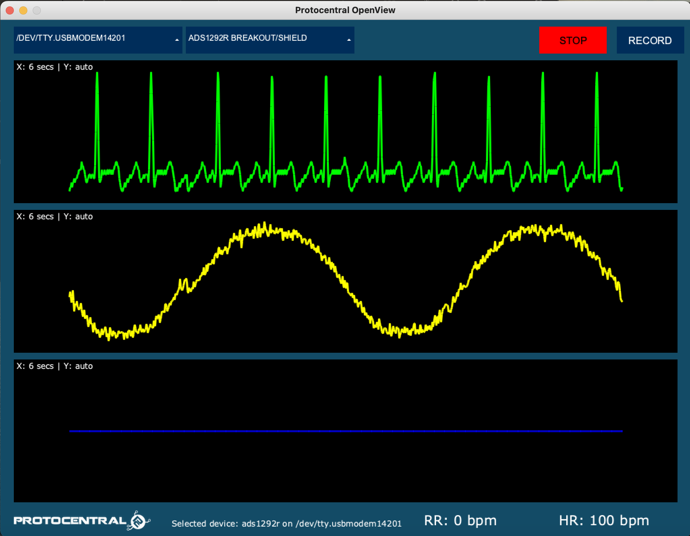

# Protocentral ADS1292R ECG/respiration Arduino Library

## Don't have one? [Buy shield here](https://protocentral.com/product/ads1292r-ecg-respiration-shield-for-arduino-v2/)

## Don't have one? [Buy breakout here](https://protocentral.com/product/ads1292r-ecg-respiration-breakout-kit/)

Easily monitor ECG and respiration using your Arduino with this plug-in shield. The version 2 of this product adds a new SPI pin header making it compatible with newer Arduino devices including the Arduino Yun and 3.5mm connector for the electrodes. We now include the electrodes and cable also with the shield

Just plug it into an Arduino and you're ready to go. The 3.5 mm circular connector provides an easy way to connect electodes to the shield. The other end of this cable has snaps for standard ECG electrodes. We also include a pakc of 10 disposable EG electrodes. It accepts two ECG electrodes and one Driven Right Leg (DRL) electrode for common mode noise reduction.

Another interesting feature of this shield is that you can also measure the respiratory activity using the same two electrodes connected to the shield. The ADS1292R uses a method known as impedance pneumography to measure respiration using the changes in chest impedance caused during respiration.

## Hardware Setup

Connection with the Arduino board is as follows:

|ADS1292R pin label| Arduino Connection   |Pin Function      |
|----------------- |:--------------------:|-----------------:|
| MISO             | D12                  |  Slave out   |             
| MOSI             | D11                  |  Slave in         |
| SCK              | D13                  |  Serial clock     |
| CS               | D7                   |  chip select      |
| DRDY             | D6                   |  Data Ready Output|
| START            | D5                   |  Start Input      |
| PWDN/RESET       | D4                   |  Reset            |
| VDD              | +5V                   | Power Supply      |
| GND              | GND                  | GND               |

# Visualizing Output

## For further details, refer [the documentation on ADS1292R breakout board](https://docs.protocentral.com/getting-started-with-ADS1292R/)

License Information
===================

This product is open source! Both, our hardware and software are open source and licensed under the following licenses:

Hardware
---------

**All hardware is released under [Creative Commons Share-alike 4.0 International](http://creativecommons.org/licenses/by-sa/4.0/).**

You are free to:

* Share — copy and redistribute the material in any medium or format
* Adapt — remix, transform, and build upon the material for any purpose, even commercially.
The licensor cannot revoke these freedoms as long as you follow the license terms.

Under the following terms:

* Attribution — You must give appropriate credit, provide a link to the license, and indicate if changes were made. You may do so in any reasonable manner, but not in any way that suggests the licensor endorses you or your use.
* ShareAlike — If you remix, transform, or build upon the material, you must distribute your contributions under the same license as the original.

Software
--------

**All software is released under the MIT License(http://opensource.org/licenses/MIT).**

THE SOFTWARE IS PROVIDED "AS IS", WITHOUT WARRANTY OF ANY KIND, EXPRESS OR IMPLIED, INCLUDING BUT NOT LIMITED TO THE WARRANTIES OF MERCHANTABILITY, FITNESS FOR A PARTICULAR PURPOSE AND NONINFRINGEMENT. IN NO EVENT SHALL THE AUTHORS OR COPYRIGHT HOLDERS BE LIABLE FOR ANY CLAIM, DAMAGES OR OTHER LIABILITY, WHETHER IN AN ACTION OF CONTRACT, TORT OR OTHERWISE, ARISING FROM, OUT OF OR IN CONNECTION WITH THE SOFTWARE OR THE USE OR OTHER DEALINGS IN THE SOFTWARE.

Please check [*LICENSE.md*](LICENSE.md) for detailed license descriptions.
